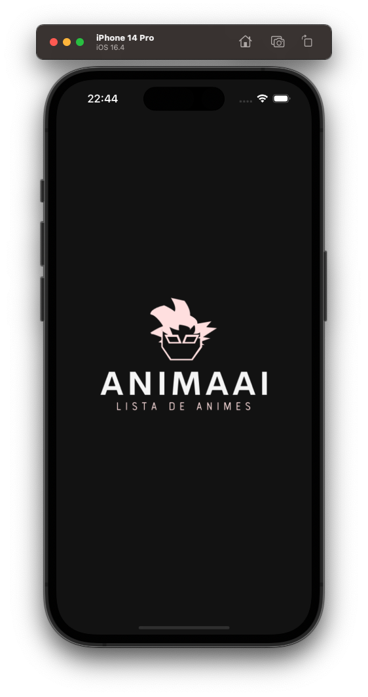
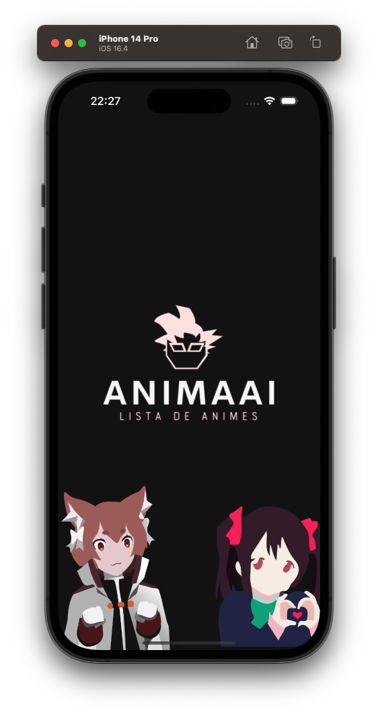
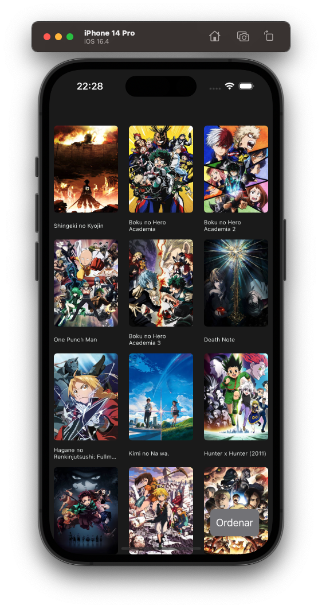
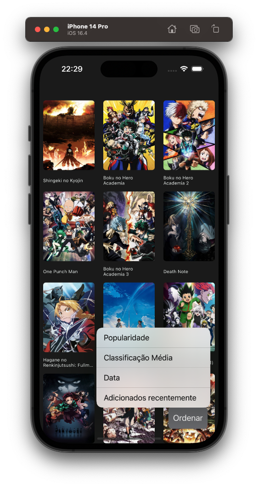
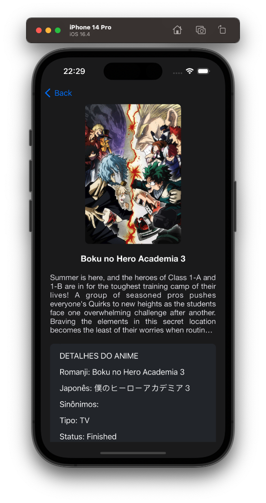

# AnimaAI


<hr>


> O AnimaAI é uma aplicação iOS inovadora desenvolvida em Swift que permite aos entusiastas de animes explorar e descobrir seus animes favoritos de uma maneira inteligente. Combinando a paixão por animes com a potência da inteligência artificial, o AnimaAI oferece uma experiência de visualização única.

## 💼 SCREENSHOTS

<h1 align="center">
  
  
  
  
  
</h1>

## 🎥 DEMO

https://github.com/Uniao-do-Pao-de-Queijo/AnimaAI/assets/55034436/695f8bd4-78ac-46ad-915c-1efe85224be8


## 👩🏾‍💻 Technologies

- [x] UIKit
- [x] ViewCode
- [x] Storyboard
- [x] UICollectionView
- [x] Lottie

## 💻 Requirements to install code

Before starting, check the following requirements:

- MacOS
- Xcode installed
- Git installed

## 🚀 Installing app code on macbook

if you have ssh configured, run the command

```
git clone git@github.com:Uniao-do-Pao-de-Queijo/AnimaAI.git
```

if you don't have ssh configured, run the command

```
git clone https://github.com/Uniao-do-Pao-de-Queijo/AnimaAI.git
```

After installing, open the installed folder with XCode and run `command + R`

## 📫 Contributing

1. Fork this repository
2. Create a new branch: `git checkout -b <branch_name>`.
3. Make changes and commit: `git commit -m '<commit_message>'`
4. Send to base branch: `git push origin Tegami / <local>`
5. Create a pull request.

see the GitHub documentation on [how to create a pull request](https://help.github.com/en/github/collaborating-with-issues-and-pull-requests/creating-a-pull-request)

## 🤝 By

<table>
  <tr>
    <td align="center">
      <a href="https://github.com/rod-moraes">
        <br>
        <sub>
          <b>Rodrigo Moraes</b>
        </sub>
      </a>
    </td>
    <td align="center">
      <a href="https://github.com/gabsrossi">
        <br>
        <sub>
          <b>Gabriele Rossi</b>
        </sub>
      </a>
    </td>
  </tr>
</table>
